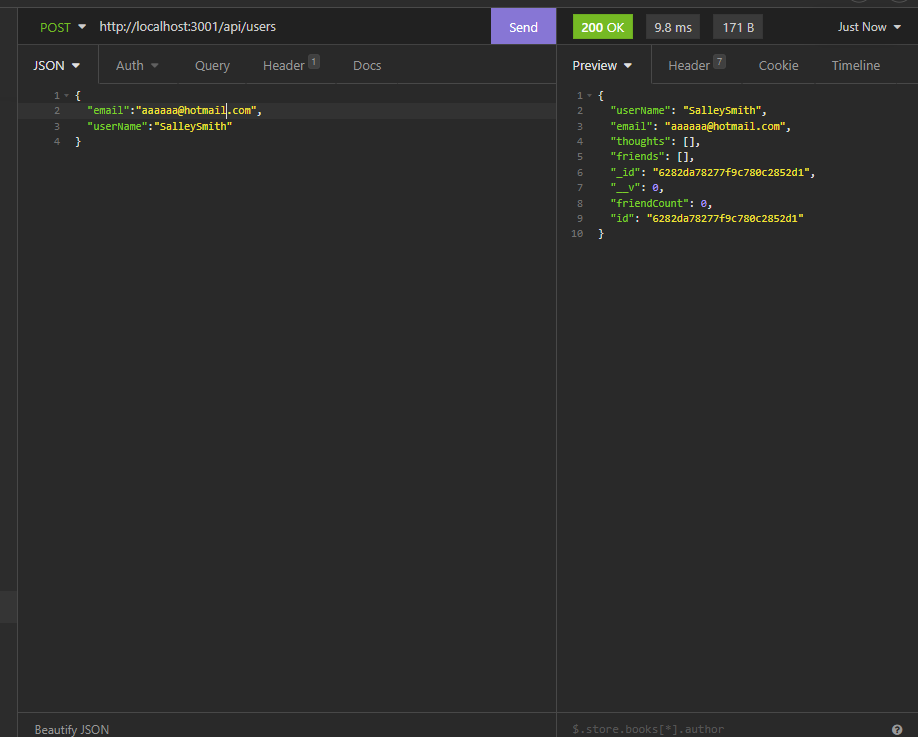
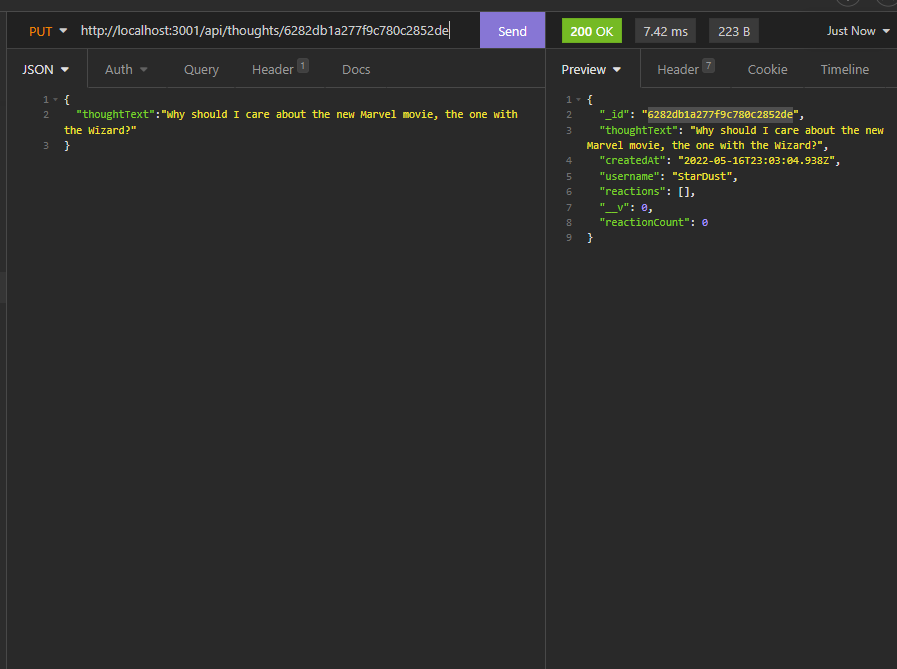
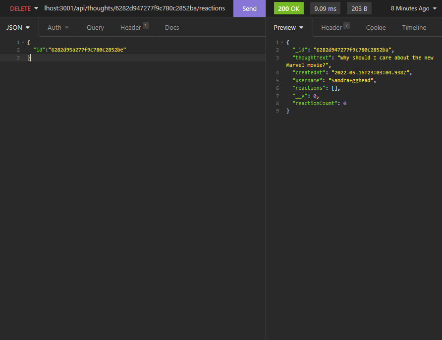

# Net Friend
  

  
## Description

This is the back-end of a hypothetical Social Networking app. It has been developed for the sake of working on CRUD operations using Mongoose. It also employs some virtuals and subdocuments.

## Table of Contents

- [Installation](#installation)
- [Usage](#usage)
- [Credits](#credits)
- [Features](#features)
- [Contribute](#contribute)
- [Tests](#tests)
- [Questions](#questions)
- [License](#license)
- [Screenshots](#screenshots)

## Installation

1. Clone Repo, 2. run npm i in terminal. 3. Use npm start to run program. 4. Use a tool such as Insomnia to run the routes.

## Usage

Registering a new user. Adding thoughts. Adding reactions. Making friends.

## Credits

Collaborators
- N/A

Third Party Assets
- Express, Mongoose, and MongoDB.

Tutorials
- https://vimeo.com/manage/videos/710575385/privacy

## Features

- Get Users, Add new User, Get Single User, Update User, Delete User, Add Friend, Remove Friend, Get Thoughts, Get Single Thought, Add Thought, Update Thought, Delete Thought, Add Reaction, and Delete Reaction.

## Screenshots

## How to Contribute

N/A
  
## Tests

N/A

## Questions

Any questions? Contact me at:
- E-mail: joechristiansonwebdev@gmail.com
- GitHub: http://www.github.com/JoeChristianson
- Other means: N/A

## License

This app is covered by the MIT license. For more information, visit https://opensource.org/licenses/Apache-2.0.

## Video Walkthrough

https://vimeo.com/manage/videos/710575385/privacy